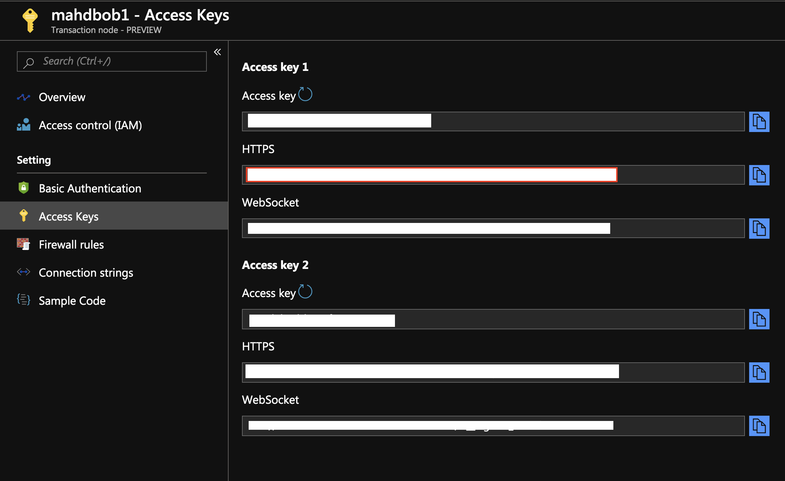
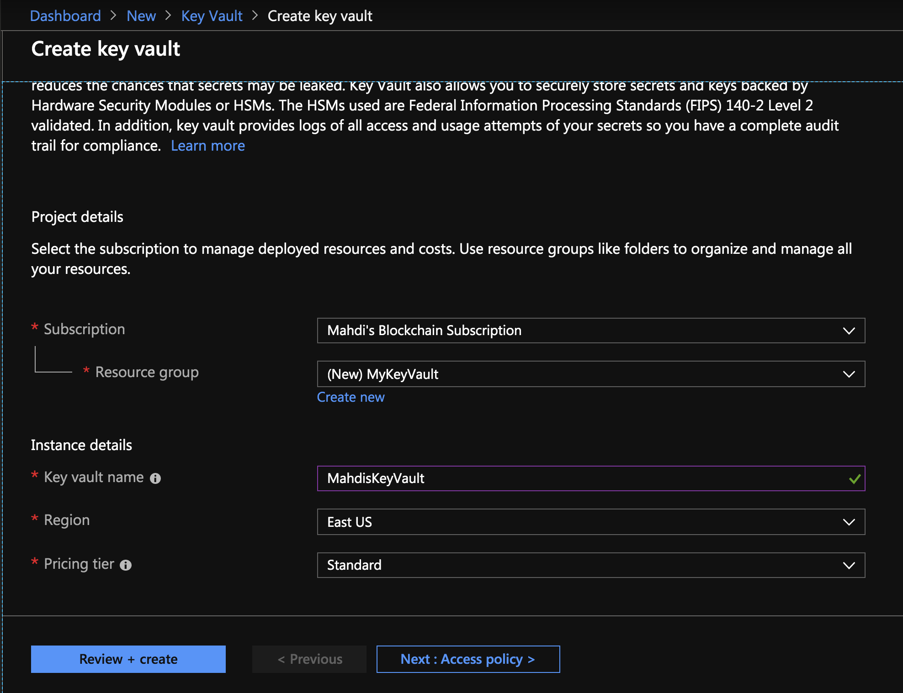
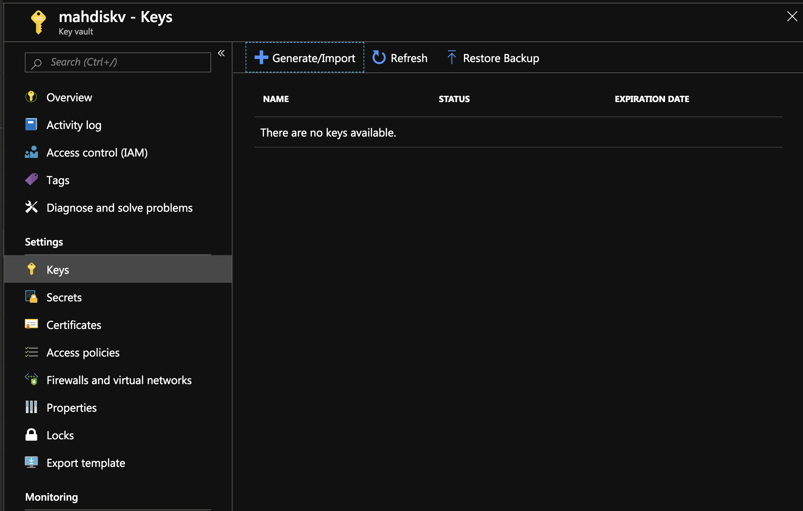
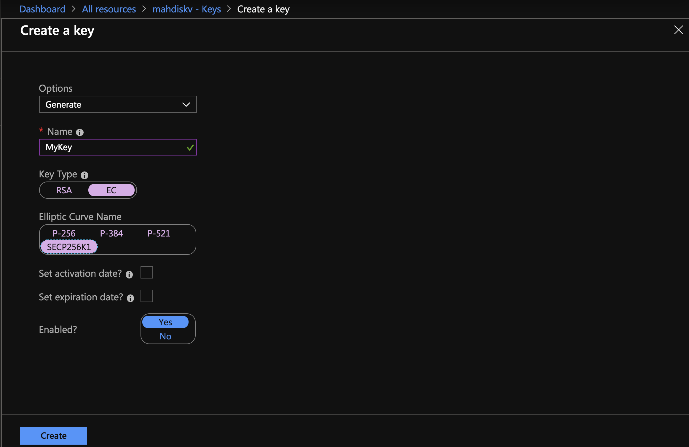
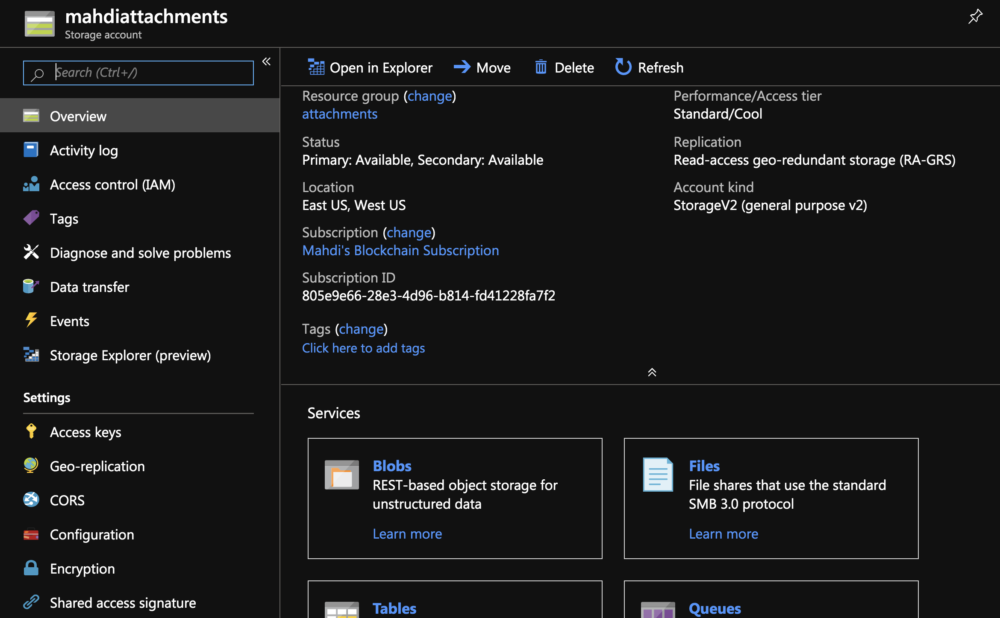
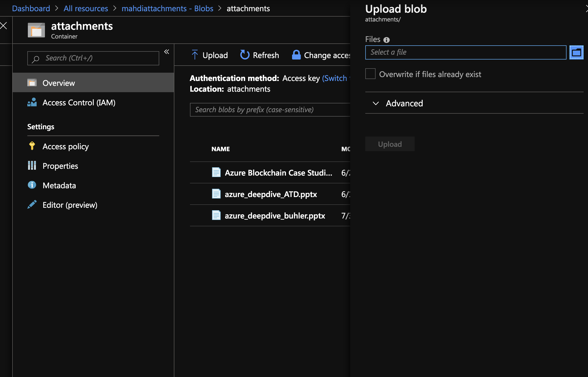
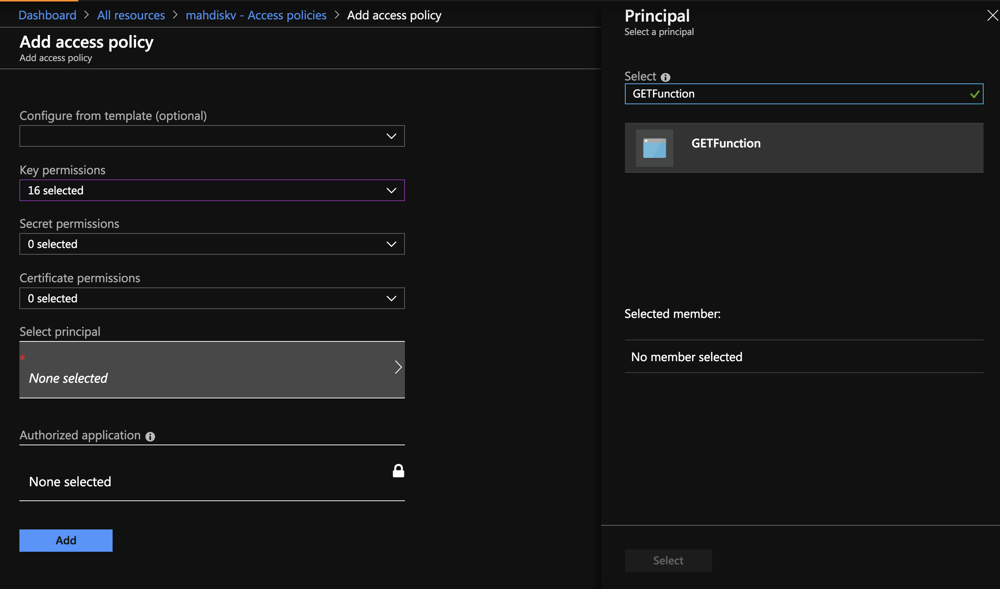

# Introduction 
This project contains a sample for running Quorum microservices on [Azure Kubernetes Service](https://docs.microsoft.com/en-us/azure/aks/intro-kubernetes).

All microservice code will be written in dotnet core using the Nethereum.Quorum packages and will communicate with endpoints exposed via the [Azure Blockchain Service](https://azure.microsoft.com/en-ca/services/blockchain-service/).

This sample is not meant for production use, it is a sample.

It demonstrates the following concepts that are important in Enterprise blockchain deployments:
1. Private Key being managed by an HSM (Azure Key Vault) with the signing operations being done IN the HSM, and the key not being accessible to the application. This is facilitated through [Nethereum.Signer.AzureKeyVault](https://www.nuget.org/packages/Nethereum.Signer.AzureKeyVault/)

2. Creating and calling smart contracts with Quorum and Nethereum, using the ExternalAccount object with a reference to our private key (or ethereum account) that is held in KeyVault

3. A helper class named "QuorumTransactionManager" that handles deployment and calling smart contracts. The class contains methods that do a variety of things asynchronously. The class is meant to be generic in that it works for ANY smart contract, so long as you supply the appropriate parameters.

With this sample, we demonstrate a scenario where the details of the Private Key are stored securely in the cloud and we create our Ethereum account on the fly from the details of that key. 

This sample is an extension of the project hosted at https://github.com/malirezai/QuorumFunctionWithKeyVault by Mahdi Alirezaie.

## Project references:

The following nuget packages are referenced: 

- [Nethereum.Quorum](https://www.nuget.org/packages/Nethereum.Quorum/)
- [Nethereum.Accounts](https://www.nuget.org/packages/Nethereum.Accounts/)
- [Nethereum.Signer.AzureKeyVault](https://www.nuget.org/packages/Nethereum.Signer.AzureKeyVault/)
- [Polly.NET](https://www.nuget.org/packages/Polly/) for resilient APIs

## Prerequisites

This readme will not walk you through using Nethereum or setting up an Azure Blockchain service node. 

For Nethereum documentation please refer to: https://docs.nethereum.com/en/latest/

For setting up an Azure Blockchain service node please refer to: https://docs.microsoft.com/en-us/azure/blockchain/service/create-member

For setting up an AKS cluster with AAD Pod Identity, please refer to https://github.com/Azure/aad-pod-identity.

For setting up VSCode for use with Solidtity, please download the VSCode Solidity Extension.

It is assumed that the people following this guide have a good understanding of Ethereum concepts (Contracts, functions, signing operations, nonces, submitting transactions via Web3, ect).

## What You Need to Run this Sample

This sample comes complete with a local.settings.json file that has a few Environment variables set. We really only need to set up 4 Azure services, and copy a few values to "local.settings.json"

1. An Azure Blockchain Service Node - so we have our RPC Endpoint
2. An Azure Key Vault to store our private Key 
3. A Blob storage account for storing the compiled smart contract's JSON file (that contains the bytecode and ABI)
4. An AKS cluster with AAD Pod Identity Deployed.
5. (Optional) A Service Principal for the KeyVault above so we can grab the key when deploying our function locally with an Application ID and associated Secret

# Getting Started

## Creating an Azure Blockchain Service Node 

Create a new Azure Blockchain Service node and make a note of the RPC Endpoint by going to Transaction Nodes -> Click on your Node -> Access Keys. Use this value for "RPC"

## Create an Azure Key Vault and a Private Key

Create an Azure KeyVault and skip the steps pertaining to Access Policies and Virtual Network: 

Click on Keys, then, Generate An Elliptic Curve Key using the SECP256K1 Curve:

Next, Grab the URL of the above Key and paste it into the value for "KEYVAULT_PRIVATEKEY_URI" of the QuorumService.yaml file.

## Create a Storage Account to hold our Smart Contract JSON file

Create a storage account and create a container within "Blobs" that has anonymous read access for blobs:

Upload the JSON file to the blob container. For an example JSON file generated from a contract compilation (SimpleStorage) please take a look here: https://raw.githubusercontent.com/bobjac/QuorumAKSWithKeyVault/master/abi/SimpleStorage.json.

Update the CONTRACT_JSON_BLOB_URL value in the QuorumService.yaml file url of the uploaded smart contract json file.

## Create and AKS Cluster with AAD Pod Identity Deployed

All microservice code will be containerized and deployed to Azure Kubernetes Service. The containers in AKS will need to access the Azure Key Vault that is storing the key that was generated in the step above, and this sample will use Azure Managed Service Identity to ensure that no credentails to the Azure Key Vault are ever given to the developers of the microservices. AAD Pod Identity is a project that enabled AKS pods to take on the identity of the Azure Managed Service Identity resource, so administrators can grant the managed service identity access to the Azure Key Vault without requiring the developers to know the credentails of the service principal.

Details on creating the Azure Kubernetes Service cluster, as well as deploying the necessary AAD Pod Identity Resources can be found at the AAD Pod Identity Repository at https://github.com/Azure/aad-pod-identity.

You should also go through the public documentation for buildin a Docker container, deploying to Azure Container Registry and pushing to AKS.

## Grant the Managed Service Identity Access to the Azure Key Vault

Go back to your KeyVault resource, and click on Access Policies -> Add Access Policy

Becase we only need access to the Key, use "Select All" under Key Permissions for simplicity. 

**NOTE:** In practice, don't grant the "Select All" Property, we really only need GET, LIST and SIGN operations, so if you'd like to keep it those three, please do that instead. 

Under "Select Principal", search for the name of the managed service identity that was created in the insturctions found at https://github.com/Azure/aad-pod-identity. This will allow you to grant access to the Azure Key Vault for the AKS pod.

At this point we're done! Make sure your KeyVault policies are saved. You have now granted the AKS deployment/pod access to your KeyVault Key. 

We can use the URL to the Private Key and AKS will automatically grant access to it behnid the scenes. 

## Build Quorum Service Docker image

You will find a docker file located at /src/Bobjac.QuorumService. Build the container image using the standard docker command line tools and deploy to Azure Container Registry.  

## Deploy microservice to AKS

Replace the container image (currently bobjacfoodsafety.azurecr.io/quorumservice:v2) in the QuorumService.yaml file. You should also replace all of the environment variables with vaules that are specific to you deployment, such as your contract blob url, Azure Blockchain Service endpoint, etc.  After modifying the QuorumService.yaml file, deploy it using standard kubernetes techniques.